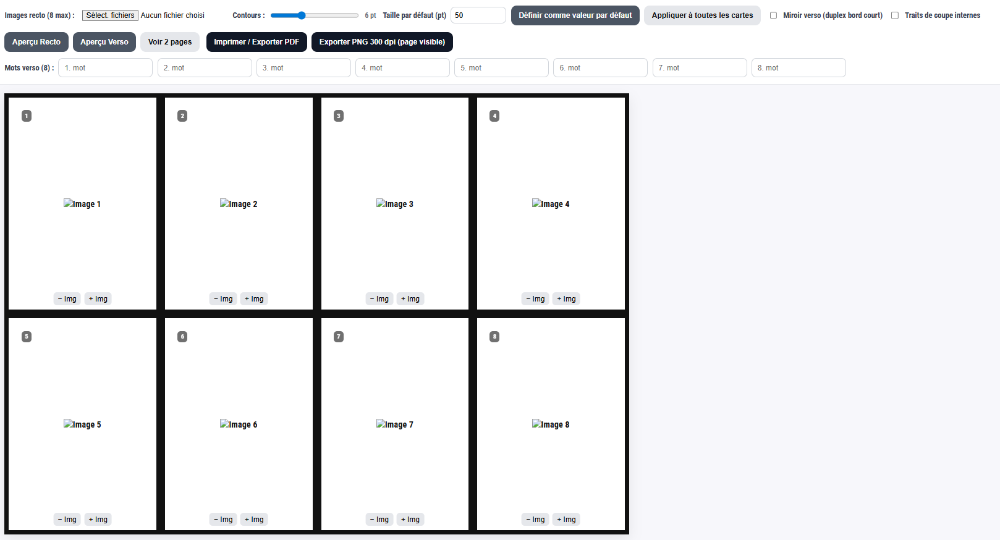

# 🎴 Flashcard Generator

Ce projet est un **générateur de planches de flashcards éducatives** au format **A4 paysage** (8 cartes format A7 par page).  
Il permet de créer facilement des cartes pédagogiques recto-verso prêtes à être imprimées.

---

## ✨ Fonctionnalités

- 📷 **Recto** : import jusqu’à 8 images (une par carte).
- ✍️ **Verso** : saisie de 8 mots (texte dynamique).
- 🎨 **Catégorisation automatique** :
  - `_nom` → bleu  
  - `_verbe` → rouge  
  - `_adj` → vert  
  - `_prep` → orange  
- 🔧 **Options d’édition** :
  - Ajustement de la taille du texte (global ou par carte).
  - Redimensionnement des images (+/−).
  - Césure automatique après l’article (« un », « une », « des »).
- 🖨️ **Export** :
  - Impression en PDF via `Ctrl+P`.
  - Export en **PNG 300 dpi** (recto ou verso).
- ➕ **Options avancées** :
  - Traits de coupe internes.
  - Miroir verso (pour impression recto-verso alignée).

---

## 🚀 Démo en ligne

👉 [Voir la démo sur GitHub Pages](https://rachid-hammami.github.io/flashcard-demo/)  
(*remplace `ton-username` par ton pseudo GitHub*)

---

## 📂 Structure du projet

flashcard-demo/
│
├── index.html # Structure de la page + liens vers CSS/JS
├── style.css # Feuille de styles
├── script.js # Logique JavaScript
└── README.md # Ce fichier

---

## 💡 Utilisation

1. **Cloner le dépôt** ou télécharger le ZIP.  
2. Ouvrir `index.html` dans un navigateur moderne (Chrome, Firefox, Edge).  
3. Charger vos images et vos mots → les cartes se mettent en page automatiquement.  
4. Imprimer ou exporter en PNG.

---

## 📜 Licence

Projet libre d’utilisation à but pédagogique.  
Créé dans le cadre d’un projet d’outils éducatifs pour l’apprentissage du vocabulaire.

## 📸 Aperçu

